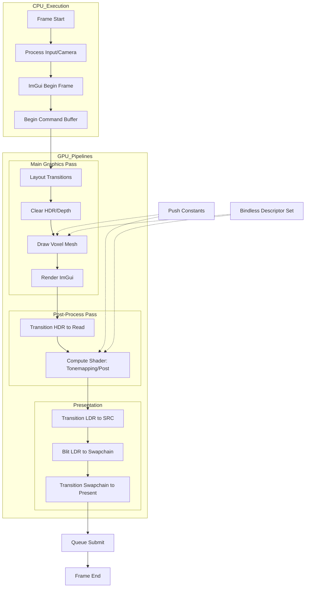

# Rendering Pipeline

This document describes the high-level rendering architecture and frame execution flow of the renderer.

## Frame Architecture

The renderer follows a **Bindless** model utilizing a single descriptor set layout and pipeline layout for all stages. Resources are managed through an `offset_allocator` for sub-allocations within large GPU buffers.

### Rendering Flow

## Stages Detail

### 1. Main Pass (Graphics)
- **Inputs**: Voxel data (via `face_ptr` in Push Constants), Textures (Bindless), Camera Matrices.
- **Targets**: `hdr_color` (R16G16B16A16_SFLOAT), `depth_buffer`.
- **Logic**: Iterates over packed voxel faces, performs vertex transformation, and samples from bindless texture arrays.

### 2. Post-Process (Compute)
- **Inputs**: `hdr_color` (Sampled), Linear Sampler.
- **Outputs**: `ldr_color` (Storage Image).
- **Logic**: Performs tonemapping and color corrections.

### 3. Presentation
- **Action**: `vkCmdBlitImage` from `ldr_color` to the current Swapchain image.
- **Conversion**: Handles the transition from internal HDR/LDR formats to the swapchain's display format (e.g., `B8G8R8A8_UNORM`).

## Resource Management
- **Buffers**: Large `BufferPool` sub-allocated via `offset_allocator`.
- **Textures**: Registered into a global bindless `texture_pool`.
- **Synchronization**: Uses `vkCmdPipelineBarrier2` (Sync2) for layout transitions and dependency management.
